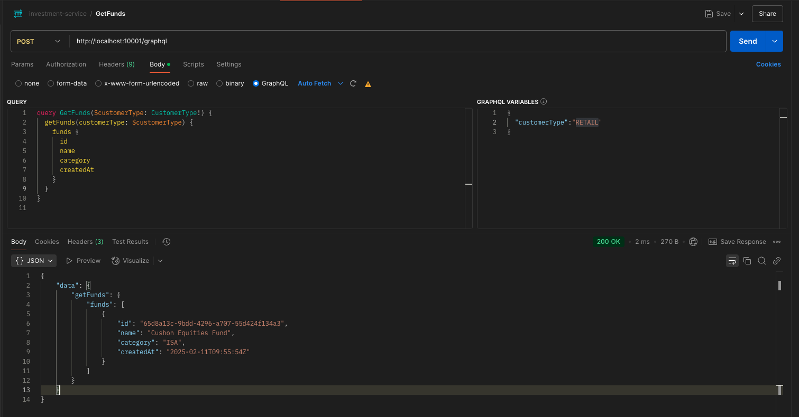
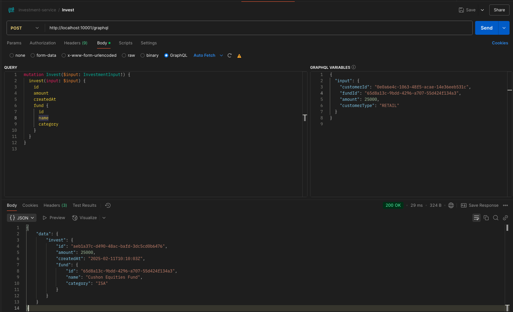
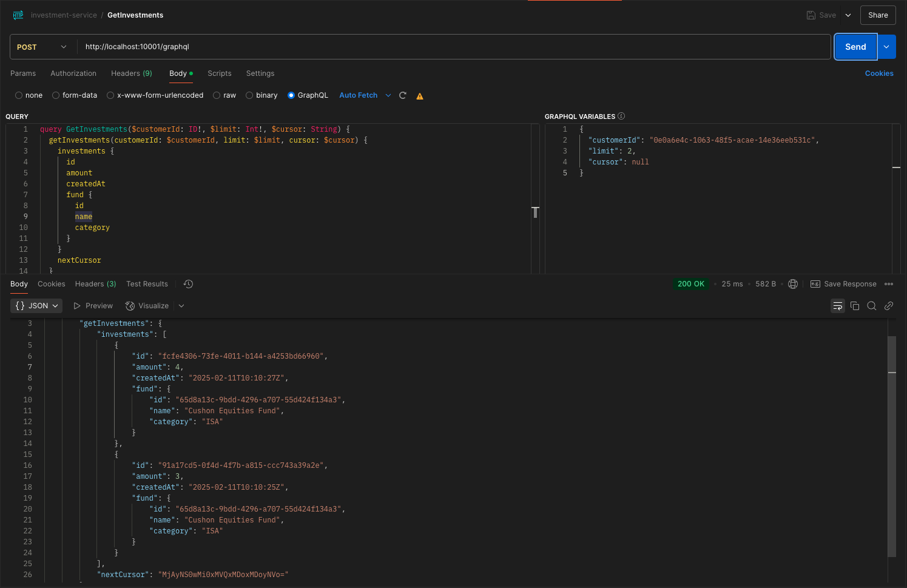
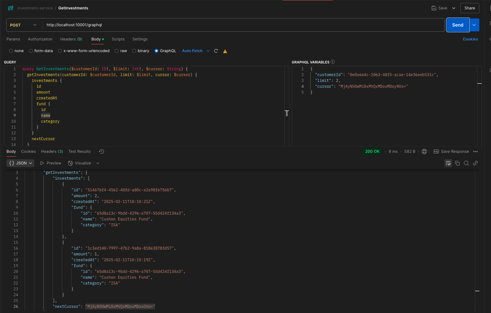
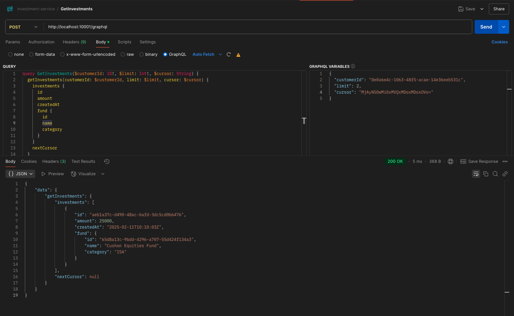

# investment-service

The Investment Service handles the processing and management of customer investments into available funds.

## Running Locally

Run `docker-compose up -d --build investment-service ` to initialize the service, and all of its dependencies

I have included a postman collection to use when running the service [here](./task-resources/investment-service.postman_collection.json)

## Running Tests

Run `go test ./...`

## Mockery

This service uses [mockery](https://vektra.github.io/mockery/) to generate mock interfaces for testing.

* install via homebrew `brew install mockery`
* generate mocks using `go generate ./...`

To mock a new interface add a comment in the same file like this:
```go
//go:generate mockery --name Example
type Example interface {
	Test() string
}
```

## Environment Variables

There is only 1 environment variable that is required in this service.

*   DATABASE_URL - The URL for the database

## API

* Usually i would generate graphQL documentation via SpectaQL. However for the purposes of this task i have included a postman collection [here](./task-resources/investment-service.postman_collection.json)

## Problem statement

- A Bank already offers ISAs and Pensions to Employees of Companies (Employers) who have an existing arrangement with
the Bank. A Bank would like to be able to offer ISA investments to retail (direct) customers who are not associated with an
employer. A Bank would like to keep the functionality for retail ISA customers separate from it’s Employer based offering
where practical.

- When customers invest into a Bank ISA they should be able to select a single fund from a list of available options. Currently
they will be restricted to selecting a single fund however in the future we would anticipate allowing selection of multiple
options.
Once the customer’s selection has been made, they should also be able to provide details of the amount they would like to
invest.

- Given the customer has both made their selection and provided the amount the system should record these values and allow
these details to be queried at a later date.
As a specific use case please consider a customer who wishes to deposit £25,000 into a Bank ISA all into the Bank
Equities Fund.

## Requirements
- A customer should be able to invest in a single fund from a predefined list.
- The system should store the selected fund and investment amount.
- Initially they can only invest in one fund (future support for multiple funds).
- Customers must specify how much they want to invest.
- When investing the amount must be greater than zero
- Customers should be able to fetch their investment details: Fund name, Amount invested, Investment date
- There should be an API to list all available funds.
- There should be a seperation of business rules for retail and employee investments

## Assumptions
- Customers already exist - we wont manage users creation or authentication
- Authentication with JWT - although not implemented in this solution, i assume we are using JWTs and need to consider implementing this in the future in this service.
- Fund data already exists in the database - I have not implemented an endpoint to create fund data as i assume this will be handled in another microservice. I have however inserted some default data for funds in a migrations file
- When investing the amount must be greater than zero and meet any minimum deposit limits (we dont have any info on this).
- We dont need to worry about cancelling investments (although this could be a feature in the future)
- Assuming investments are made in GBP only (or whatever the default is), without multi-currency support.
- Assuming all funds have the same rules for now (no ruling on how many investments you can make etc)
- Assuming the service does not need to handle tax implications of ISAs (this is likely managed by another service).

## Decision log
- **Use a microservice style architecture with domain driven elements** - although only one service, we are using microservice principles (only handles investments/single responsibility, independent database storage, API driven, and doesnt store session state etc)
- **Use GraphQL over REST** - Service is likely going to be used by a front end that might need flexible queries, we are working with relational data and this gives us the chance to build on the API is a more scalable fashion.
- **Use Postgres** - well suited for the data we are working with (relational), we could use any relational DB but i have opted for postgres.
- **Dont use a ORM** - lots of overhead and using SQL queries allows us to take a more performant, fine grained approach. This does come at a tradeoff for readability
- **Dont use internal package** - Given this is a self contained API (not a library), there is no risk of accidental imports by external projects, so to keep it simple i have decided not to use an internal package (although it is idiomatic to use one).
- **DDD approach** - use investment module to encapsulate business logic. We could extend this to have more domain related modules in the future
- **Seperate database from investment (domain) module** - although with DDD the database could be considered part of the investment domain, i have decided to seperate them. This leans into better seperation of concerns and makes our database module reusable across domain modules.
- **Keep the main.go file clean** - I have opted to use a service module to handle the service and dependency setup.
- **Make a clear distinction between employee and retail customers in investment module** - seperate the creating of investments for retail and employee customers, so we can easily add more business rules for each case in the future.
- **Cursor based pagination** - I decided to use a cursor based pagination implementation as if we are working with large data sets, the OFFSET can introduce performance issues. Also a large influx of created investments could cause issue with shifting rows and make the user experience not good.
- **Dev Dockerfile** - The Dockerfile in this repo is for dev purposes only, i have added a sample production Dockefile (although i didnt get time to test this)

## Improvements
- Implement multi fund investments - update graphQL to take a list of investments, process multiple investments in single db transaction, use concurrency to handle request faster (would have to be careful with race conditions for fund rules like a max deposit. We could use a row lock on the db or mutex's if its not db related)
- Use transactionIDs to prevent accidental duplicate investments
- Implement auth middleware to check JWT in request and extract customerID (for example) from the claims in the context in the gql handlers.
- Add better fund information (very basic right now)
- Implement a cancel investment / withdraw endpoint
- Validate investment inputs when createInvestment is called
- Allow filters (like customer_type) when getting investments
- Implement better errors returning from graphQL requests (making sure we dont leak implementation details)
- Implement tests across the board (currently only business logic package has been covered)
- Implement integration tests (spin up a database, make a GraphQL call)
- Implement load testing: artillery or K6 maybe?
- Implement tracing (Jaeger?)
- Implement metrics and dashboard. Transaction count per customer, Transactions per fund etc (grafana? datadog?)
- Implement a CICD pipeline
- Implement a cache for getFunds/getInvestments (redis or even in memory) might not be worth it depending on how this service would be used.
- Handle high load better: load balancer, read/write db instances?, message queues for transactions, index the db, add a rate limiter, add horizontal pod autoscaling (if using K8s), caching endpoints
- build graphQL documentation with SpectaQL

## Local dev testing

- getFunds (query)


- invest (mutation)


- getInvestments with pagination(query)



